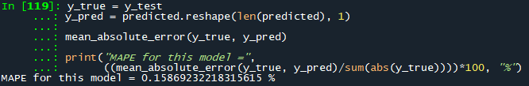

# Malaysia COVID-19 Prediction (Deep Learning)
 Predicting Malaysia COVID-19 new cases with deep learning approach.

# Description

The year 2020 was a catastrophic year for humanity. Pneumonia of unknown
aetiology was first reported in December 2019., since then, COVID-19 spread to
the whole world and became a global pandemic. More than 200 countries were
affected due to pandemic and many countries were trying to save precious lives
of their people by imposing travel restrictions, quarantines, social distances, event
postponements and lockdowns to prevent the spread of the virus. However, due
to lackadaisical attitude, efforts attempted by the governments were jeopardised,
thus, predisposing to the wide spread of virus and lost of lives.
The scientists believed that the absence of AI assisted automated tracking and
predicting system is the cause of the wide spread of COVID-19 pandemic. Hence,
the scientist proposed the usage of deep learning model to predict the daily
COVID cases to determine if travel bans should be imposed or rescinded

# How to use

1. Clone this repository and use saved model and encoder inside the "saved_models" folder to be deployed to your dataset
2. You can also use the modules that I have created in the "modules.py".
3. Don't forget to include the init.py blank file.
4. Run tensorboard at the end of training to see how well the model perform via conda prompt. Activate the desired environment and proper working directory
5. Type "tensorboard --logdir "the log path"
6. Paste the local network link into your browser and it will automatically redirected to tensorboard local host and done! Tensorboard is now can be analyzed.

# The Architecture of my Model

# Performance of my Model

# Tensorboard Screenshot from my Browser

# Actual and Prediction Graph

# Discussion

I have successfully trained my prediction model with this Malaysia COVID-19 new cases dataset by using deep learning approach. Everything went smoothly and I want to share about my experience dealing with this dataset! Lets' start, shall we?

1. This dataset is actually pretty decent. I just need to clean a little bit here and there, filling out NaN with linear interpolation approach (don't forget to make the value as integer!). Everything went pretty well for me, the interpolation approach works!
2. I have trained my model with LSTM (64 nodes) with dropout layers. 50 epochs was good enough for me.
3. Tensorboard graph is beautiful as well, I have no complaint.
4. I have saved all bits of scaler and model, so feel free to use it and deploy!
5. The MAPE value for this model was around 0.15% so I guess it was actually pretty decent.

To conclude everything, this model is actually satisfactory (at least for me). I am looking forward to do more analysis with different time series datasets and I will update more on my GitHub page!

# Credit

shout out to the owner of our dataset: https://github.com/MoH-Malaysia/covid19-public
